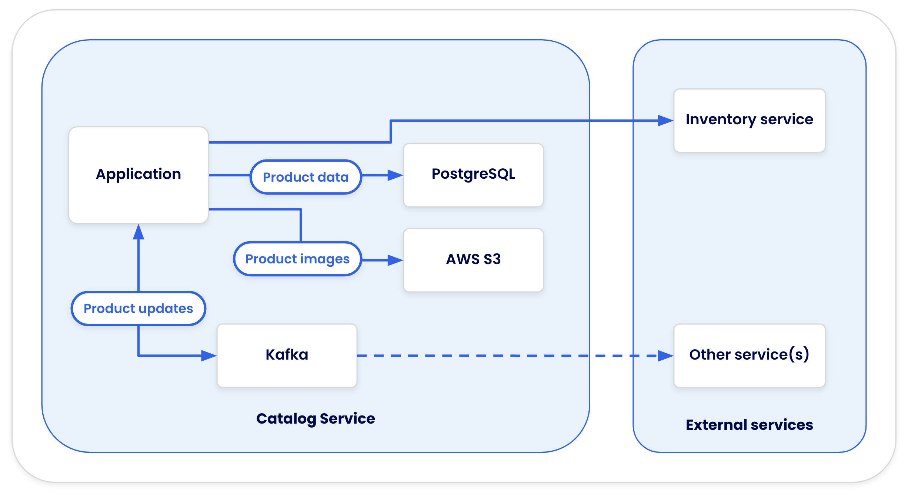
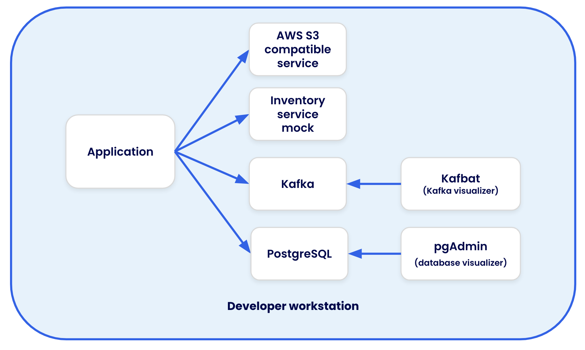

# Catalog Service - Node

This repo is a demo project that demonstrates all of Docker's services in a single project. Specifically, it includes the following:

- A containerized development environment (in a few varieties of setup)
- Integration testing with Testcontainers
- Building in GitHub Actions with Docker Build Cloud

This project is also setup to be used for various demos. Learn more about the demo setups by using [the README in the ./demo directory](./demo/README.md).

## Application architecture

This sample app provides an API that utilizes the following setup:

- Data is stored in a PostgreSQL database
- Product images are stored in a AWS S3 bucket
- Inventory data comes from an external inventory service
- Updates to products are published to a Kafka cluster



During development, containers provide the following services:

- PostgreSQL and Kafka runs directly in a container
- LocalStack is used to run S3 locally
- WireMock is used to mock the external inventory service
- pgAdmin and kafbat are added to visualize the PostgreSQL database and Kafka cluster



## Trying it out

This project is currently configured to run all dependent services in containers and the app natively on the machine (using Node installed on the machine).

To start the app, follow these steps:

1. Ensure you have [Node](https://nodejs.org) and [yarn](https://classic.yarnpkg.com/lang/en/docs/install/#mac-stable) installed on your machine.

2. Start all of the application dependencies

   ```console
   docker compose up
   ```

3. Install the app dependencies and start the main app with the following command:

   ```console
   yarn install
   yarn dev
   ```

4. Once everything is up and running, you can open the demo client at http://localhost:5173

### Debugging the application

The project contains configuration for VS Code to enable quick debgging. Once the app is running, you can start a debug session by using the **Debug** task in the "Run and Debug" panel. This currently only works when the app is running natively on the machine.

### Running tests

This project contains a few unit tests and integration tests to demonstrate Testcontainer usage. To run them, follow these steps (assuming you're using VS Code):

1. Download and install the [Jest extension](https://marketplace.visualstudio.com/items?itemName=Orta.vscode-jest#user-interface).

2. Open the "Testing" tab in the left-hand navigation (looks like a flask).

3. Press play for the test you'd like to run.

The \*.integration.spec.js tests will use Testcontainers to launch Kafka, Postgres, and LocalStack.

#### Running tests via the command line

Or you can run the tests using the command line:

```console
# Run all tests
$ yarn test

# Run only unit tests
$ yarn unit-test

# Run only the integration tests
$ yarn integration-test
```

## Additional utilities

Once the development environment is up and running, the following URLs can be leveraged:

- [http://localhost:5173](http://localhost:5173) - a simple React app that provides the ability to interact with the API via a web interface (helpful during demos)
- [http://localhost:5050](http://localhost:5050) - [pgAdmin](https://www.pgadmin.org/) to visualize the database. Login using the password `postgres` (configured in the Compose file)
- [http://localhost:8080](http://localhost:8080) - [kafbat](https://github.com/kafbat/kafka-ui) to visualize the Kafka cluster

### Helper scripts

In the `dev/scripts` directory, there are a few scripts that can be used to interact with the REST API of the application.
